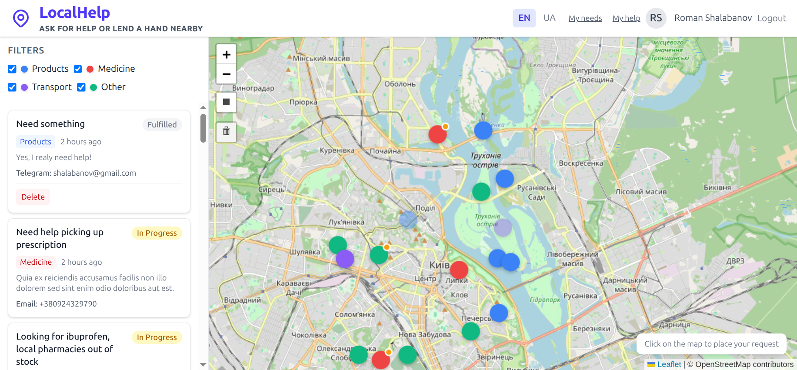
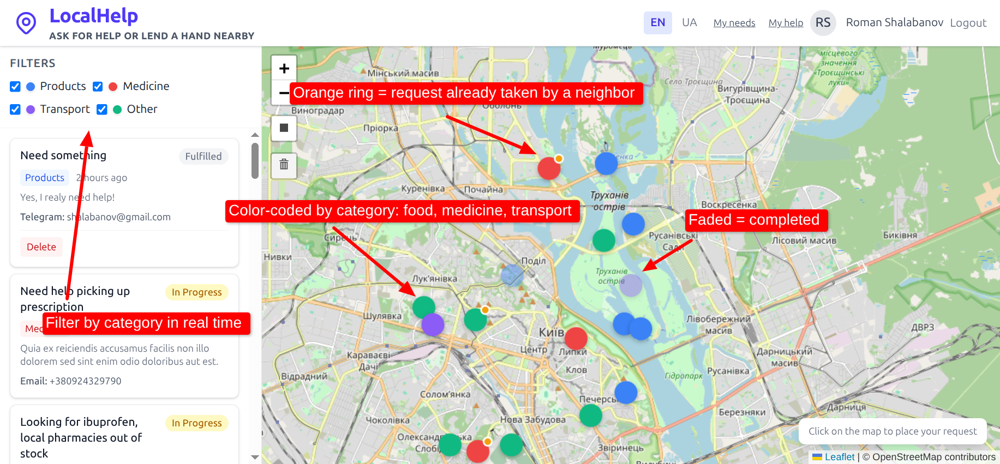
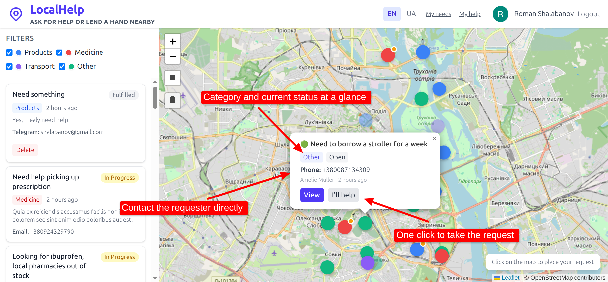
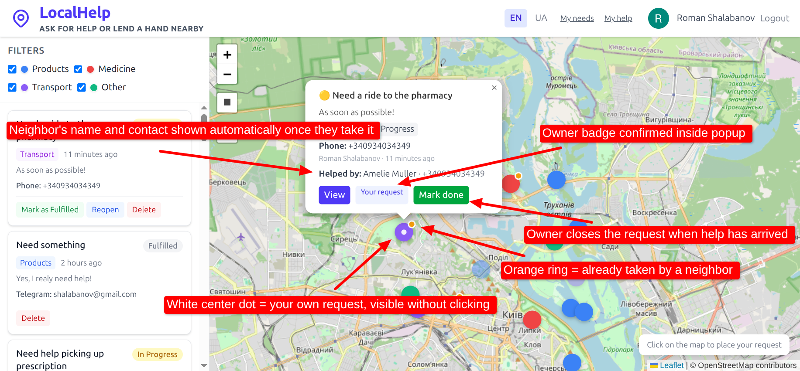

# LocalHelp

> **Neighbors helping neighbors — one click on the map.**

LocalHelp is a real-time, map-based micro-volunteering platform. Anyone can pin a request for help on the map — groceries, medicine, transport, anything. A neighbor sees it, clicks "I'll help", and both sides instantly get each other's contact. No middleman, no coordination overhead.

Built for the **DEV Weekend Challenge** in 48 hours.

---

## How It Works

### 1. Browse requests near you

Color-coded markers make the whole city readable at a glance — blue for food, red for medicine, purple for transport, teal for other. Filter by category, draw a custom area on the map, and only see what's relevant to you.


*Tap any marker to see the full request, contact details, and a single "I'll help" button*

---

### 2. Take a request — your neighbors see it instantly

When you click "I'll help", the marker gets an **orange ring** and a status dot. The person who posted the request sees your name and contact appear in their popup immediately — no page reload, no email chain. Pure WebSocket magic.


*White center dot = your own request. Orange ring = already taken. "Mark done" closes the loop.*

---

### 3. Track what you've asked for

The **My Needs** panel shows all your active requests in one place — who took them, their contact info, deadlines, and history. Fulfilled requests stay archived until they expire, so nothing disappears unexpectedly.


*In Progress shows the helper's name and contact. Fulfilled cards stay visible until the request expires.*

---

### 4. Manage what you're helping with

The **My Help** panel is your dashboard as a volunteer — every task you've committed to, with the requester's contact, category, and hard deadline. Changed your mind? Hit "Give up" and the request goes back to the map as open.


*Category badge and expiry date on every card — no guessing about priorities.*

---

## Features

| | |
|---|---|
| 🗺 **Map-first UI** | OpenStreetMap + Leaflet, draw any area to filter |
| ⚡ **Real-time** | Laravel Reverb WebSockets — updates appear instantly for all users |
| 🔴 **Visual status system** | Open / Taken (orange ring) / Fulfilled (faded) — readable without clicking |
| 🔵 **Your requests highlighted** | White center dot on your own markers, visible at a glance |
| 🌐 **Multilingual** | English + Ukrainian, switchable per session |
| 🔒 **Google OAuth** | One-click login, no passwords to forget |
| 🛡 **Spam prevention** | reCAPTCHA, daily rate limit, keyword blacklist |
| ⏱ **Auto-expiration** | Requests expire in 1h–7d (configurable), never clutter the map |

## Tech Stack

- **Laravel 12** + **Livewire v4** + Alpine.js
- **SQLite** (zero infrastructure required)
- **TailwindCSS v4**
- **Leaflet.js** + Leaflet Draw
- **Laravel Reverb** (WebSockets)
- **Laravel Socialite** (Google OAuth)

---

## Quick Start

### Option A — Local (plain PHP)

```bash
git clone <repo-url> localhelp && cd localhelp
composer install && npm install
cp .env.example .env
php artisan key:generate
```

Edit `.env`:
```dotenv
GOOGLE_CLIENT_ID=...
GOOGLE_CLIENT_SECRET=...
# RECAPTCHA is auto-skipped in local env
```

```bash
touch database/database.sqlite
php artisan migrate --seed
npm run build

php artisan serve          # http://localhost:8000
php artisan reverb:start   # WebSocket server
php artisan queue:listen   # Broadcast worker
```

### Option B — Docker (Traefik + Cloudflare Tunnel)

```bash
cp .env.example .env
# Fill in required vars (see below)
docker compose up -d
```

Required additions to `.env` for Docker:
```dotenv
WWWUSER=1000   # $(id -u)
WWWGROUP=1000  # $(id -g)

TRAEFIK_HOST=localhelp.localhost
CLOUDFLARED_TUNNEL_TOKEN=<your-token>
CLOUDFLARED_TUNNEL_DOMAIN=localhelp.example.com

APP_URL=http://localhelp.localhost
REVERB_HOST=ws.localhelp.localhost
REVERB_PORT=80
REVERB_SCHEME=http
```

The Docker setup runs **app + queue + Reverb** in a single container via supervisord, behind Traefik with optional Cloudflare Tunnel for instant public access. Traefik dashboard is available at `http://localhost:9090`.

---

## Configuration

All app-specific settings live in `config/localhelp.php`:

| Key | Default | Description |
|-----|---------|-------------|
| `locale.default` | `en` | Default language |
| `locale.available` | `['en', 'uk']` | Available languages |
| `spam.daily_limit` | `5` | Max requests per user per day |
| `map.default_lat/lng` | Kyiv | Map center |
| `map.default_zoom` | `12` | Initial zoom |
| `requests.default_expiry_hours` | `24` | Default expiry |
| `requests.max_expiry_days` | `7` | Max expiry |

---

## License

MIT
